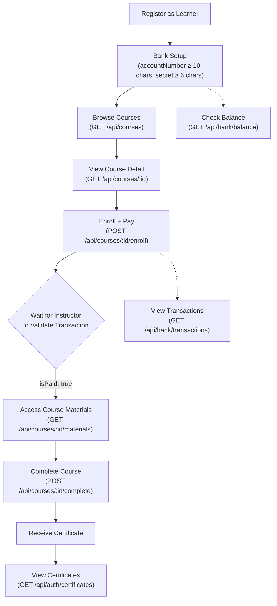
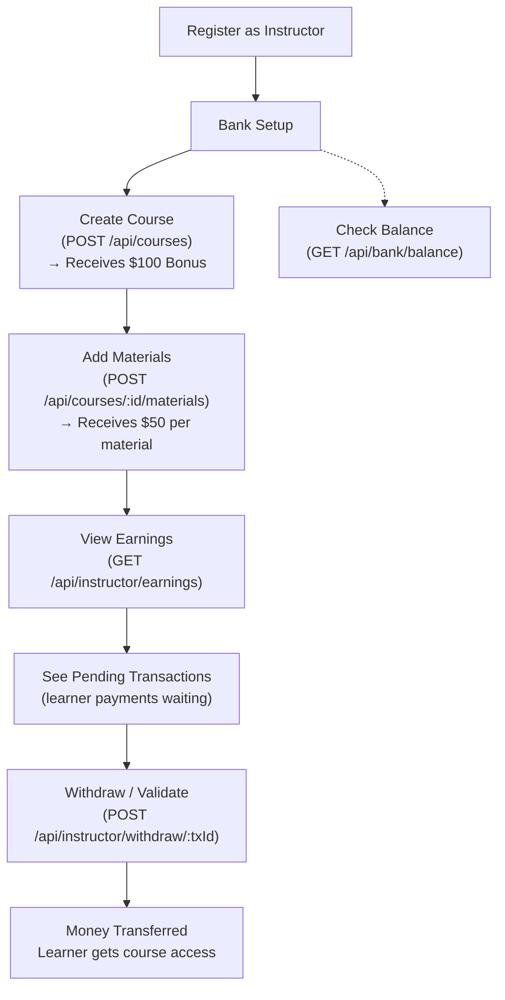
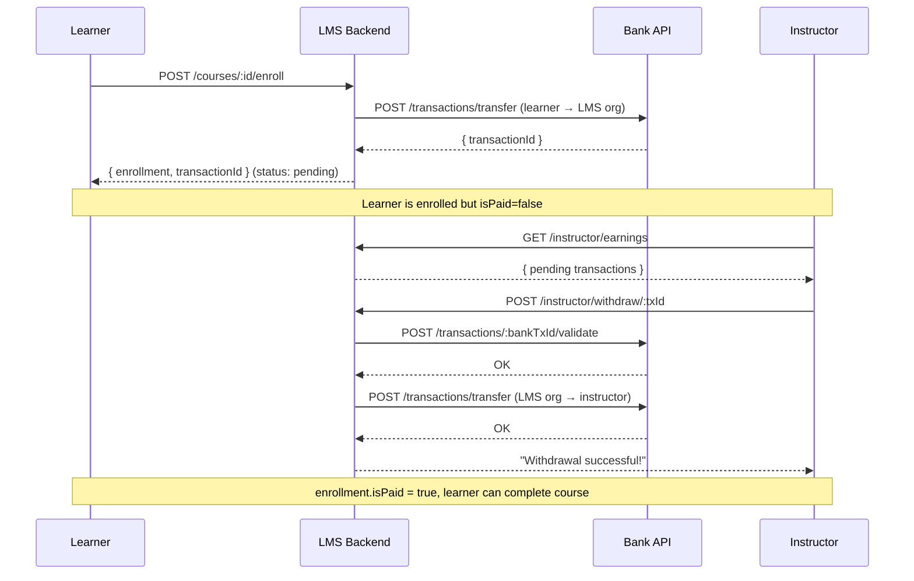
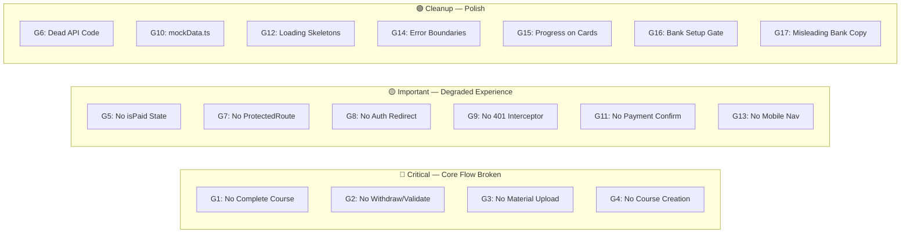

# LMS Frontend Specification

> Complete specification for building the LMS frontend, derived from the actual backend route handlers, Mongoose schemas, and project instructions. Every type, endpoint, and response shape is verified against the real backend code.

---

## 1. System Overview

The LMS system has three services:

| Service | Port | Base URL | Purpose |
|---|---|---|---|
| LMS Backend | 3001 | `http://localhost:3001/api` | Main API (auth, courses, bank proxy, instructor) |
| Bank API | 3002 | `http://localhost:3002/api` | Simulated banking (accounts, transfers) |
| LMS Frontend | 5173 | `http://localhost:5173` | React SPA (this spec) |

> [!IMPORTANT]
> The frontend **only** talks to the LMS Backend (port 3001). It never calls the Bank API directly. The LMS backend acts as a proxy for all bank operations.

### Entities & Constraints (from project instructions)
- **LMS Organisation** — hosts courses, facilitates learning, has its own bank account
- **Instructors** (max 3) — upload courses & materials, receive lump-sum payments
- **Learners** — register, set up bank, buy courses, complete courses, earn certificates
- **Courses** — system-wide max of **5 courses**
- **Bank** — every entity can check their balance; all payments flow through the bank

---

## 2. TypeScript Interfaces (Derived from Mongoose Schemas)

These interfaces map 1:1 with the backend Mongoose models. The backend returns `_id` as the MongoDB ObjectId — the frontend API layer must transform `_id` → `id`.

```typescript
// ============================================
// User (from models/User.js)
// ============================================
// Backend schema fields: name, email, password, role, bankAccount, bankSecret, hasBankSetup, createdAt
// NOTE: password, bankSecret are NEVER returned to the frontend
interface User {
  id: string;                                    // MongoDB _id
  name: string;
  email: string;
  role: 'learner' | 'instructor';               // NOT 'admin' — backend only supports these two
  hasBankSetup: boolean;                         // default: false
  bankAccountNumber: string | null;              // Mapped from `bankAccount` field. Only returned on login & profile
}

// ============================================
// Course (from models/Course.js)
// ============================================
// Backend schema fields: title, description, price, instructor (ObjectId ref), instructorName, thumbnail, duration, level, createdAt
interface Course {
  id: string;                                    // MongoDB _id
  title: string;
  description: string;
  price: number;
  instructor: string;                            // ObjectId of instructor User — field name is `instructor` not `instructorId`
  instructorName: string;
  thumbnail: string;                             // URL string
  duration: string;                              // e.g. "8 hours"
  level: 'beginner' | 'intermediate' | 'advanced';
  createdAt: string;                             // ISO date string
  // --- Enrichment fields (added by GET /courses and GET /courses/:id when authenticated) ---
  enrolled?: boolean;                            // true if current user has an Enrollment record
  progress?: number;                             // 0-100, from Enrollment.progress
  completed?: boolean;                           // from Enrollment.completed
}

// ============================================
// CourseMaterial (from models/CourseMaterial.js)
// ============================================
// Backend schema fields: courseId (ObjectId ref), title, type, content, order, createdAt
interface CourseMaterial {
  id: string;                                    // MongoDB _id
  courseId: string;                               // ObjectId of Course
  title: string;
  type: 'video' | 'text' | 'audio' | 'mcq';
  content: string;                               // URL or text content
  order: number;
  createdAt: string;
}

// ============================================
// Enrollment (from models/Enrollment.js)
// ============================================
// Backend schema fields: learnerId, courseId, isPaid, progress, completed, enrolledAt, completedAt
// NOTE: Enrollment is NOT directly returned as a standalone object to the frontend.
// Its data is merged INTO Course objects via enrichment (enrolled, progress, completed fields).
// The enrollment endpoint returns it once on creation.
interface Enrollment {
  id: string;
  learnerId: string;
  courseId: string;
  isPaid: boolean;                               // false until instructor validates transaction
  progress: number;                              // 0-100
  completed: boolean;
  enrolledAt: string;
  completedAt?: string;
}

// ============================================
// Certificate (from models/Certificate.js)
// ============================================
// Backend schema fields: learnerId, courseId, courseName, userName, issuedAt
interface Certificate {
  id: string;
  learnerId: string;                             // NOT in current frontend type
  courseId: string;
  courseName: string;
  userName: string;
  issuedAt: string;                              // ISO date string
}

// ============================================
// Transaction (from models/Transaction.js)
// ============================================
// Backend schema fields: learnerId, courseId, instructorId, amount, type, status, bankTransactionId, createdAt, completedAt
interface Transaction {
  id: string;
  learnerId: string;
  courseId: string;
  instructorId: string;
  amount: number;
  type: 'payment' | 'payout';
  status: 'pending' | 'completed' | 'failed' | 'validated';  // 4 statuses, not 3!
  bankTransactionId: string;                     // ID from Bank API
  createdAt: string;
  completedAt?: string;
  // --- Enrichment (added by GET /bank/transactions and GET /instructor/earnings) ---
  courseName?: string;                           // Joined from Course collection
}
```

> [!WARNING]
> **Key differences from the current frontend types:**
> - `Course.instructor` is the field name (not `instructorId`)
> - `Transaction.status` has **4** values including `'validated'` (current frontend only has 3)
> - `Transaction` includes `learnerId`, `instructorId`, and `bankTransactionId` (all missing from current frontend)
> - `User.role` is only `'learner' | 'instructor'` — there is NO `'admin'` role in the backend
> - `Certificate` includes `learnerId` (missing from current frontend type)

---

## 3. Authentication & Token Management

### JWT Token
- Library: `jwt-simple` (not `jsonwebtoken`)
- Token payload: `{ id, name, email, role }`
- Header format: `Authorization: Bearer <token>`
- Storage: `localStorage` keys `auth_token` and `user`

### Auth Middleware (affects every protected endpoint)
| Middleware | Behavior on failure |
|---|---|
| `authenticateToken` | `401 { error: 'No token provided' }` or `403 { error: 'Invalid or expired token' }` |
| `isInstructor` | `403 { error: 'Only instructors can access this route' }` |
| `isLearner` | `403 { error: 'Only learners can access this route' }` |
| `optionalAuth` | No error — silently continues without `req.user` |

### Session Restoration
On app mount, if `auth_token` exists in localStorage → call `GET /api/auth/profile` to validate and restore session. If it fails (403), clear localStorage.

---

## 4. Complete API Contract

### 4.1 Auth Routes (`/api/auth`)

---

#### `POST /api/auth/register`
**Auth:** None

**Request Body:**
```json
{
  "name": "string (required)",
  "email": "string (required, valid email format)",
  "password": "string (required, min 6 chars)",
  "role": "learner | instructor (required)"
}
```

**Success Response (201):**
```json
{
  "token": "jwt_string",
  "user": {
    "id": "mongo_objectid",
    "name": "string",
    "email": "string",
    "role": "learner | instructor",
    "hasBankSetup": false
  }
}
```

**Error Responses:**
| Status | Condition | Body |
|---|---|---|
| 400 | Missing fields | `{ "error": "Name, email, password and role are required." }` |
| 400 | Invalid role | `{ "error": "Role must be either learner or instructor." }` |
| 400 | Short password | `{ "error": "Password must be at least 6 characters long." }` |
| 400 | Invalid email | `{ "error": "Invalid email format." }` |
| 400 | Duplicate email | `{ "error": "User already exists with this email." }` |

---

#### `POST /api/auth/login`
**Auth:** None

**Request Body:**
```json
{
  "email": "string (required, valid email)",
  "password": "string (required, min 6 chars)"
}
```

**Success Response (200):**
```json
{
  "token": "jwt_string",
  "user": {
    "id": "mongo_objectid",
    "name": "string",
    "email": "string",
    "role": "learner | instructor",
    "hasBankSetup": false,
    "bankAccountNumber": "string | null"
  }
}
```

> [!NOTE]
> Login returns `bankAccountNumber` but register does NOT. The frontend should handle both cases.

**Error Responses:**
| Status | Condition | Body |
|---|---|---|
| 400 | Missing fields | `{ "error": "Email and password are required." }` |
| 400 | Invalid email | `{ "error": "Invalid email format." }` |
| 400 | Short password | `{ "error": "Password must be at least 6 characters long." }` |
| 400 | User not found | `{ "error": "User not found with this email." }` |
| 400 | Wrong password | `{ "error": "Password is invalid." }` |

---

#### `GET /api/auth/profile`
**Auth:** `authenticateToken` (required)

**Success Response (200):**
```json
{
  "id": "mongo_objectid",
  "name": "string",
  "email": "string",
  "role": "learner | instructor",
  "hasBankSetup": false,
  "bankAccountNumber": "string | null"
}
```

> [!NOTE]
> Profile response is a flat object, NOT wrapped in `{ user: ... }`. This differs from login/register.

---

#### `GET /api/auth/certificates`
**Auth:** `authenticateToken` (required)

**Success Response (200):** `Certificate[]`
```json
[
  {
    "_id": "objectid",
    "learnerId": "objectid",
    "courseId": "objectid",
    "courseName": "string",
    "userName": "string",
    "issuedAt": "iso_date"
  }
]
```

---

### 4.2 Course Routes (`/api/courses`)

---

#### `GET /api/courses`
**Auth:** `optionalAuth` — works without token, but enriches data if token provided

**Success Response (200):** `Course[]`
- **Without auth:** Returns raw course objects (no `enrolled`/`progress`/`completed`)
- **With auth:** Enriches each course with:
  - `enrolled: boolean` — whether current user has enrollment
  - `progress: number` — enrollment progress (0-100)
  - `completed: boolean` — enrollment completed flag

**Note:** Limited to max 5 courses by `.limit(5)` in backend.

---

#### `GET /api/courses/enrolled`
**Auth:** `authenticateToken` (required)

**Success Response (200):** `Course[]` (all enriched with `enrolled: true`, `progress`, `completed`)

---

#### `GET /api/courses/:id`
**Auth:** `optionalAuth`

**Success Response (200):** Single `Course` object, enriched if authenticated.

**Error:** `404 { "error": "Course not found" }`

---

#### `POST /api/courses`
**Auth:** `authenticateToken` + `isInstructor`

**Request Body:**
```json
{
  "title": "string (required)",
  "description": "string (required)",
  "price": "number (required, >= 0)",
  "duration": "string (required)",
  "level": "beginner | intermediate | advanced (required)",
  "thumbnail": "string (required)"
}
```

**Success Response (201):**
```json
{
  "message": "Course created successfully",
  "course": { /* Course object */ },
  "payout": {
    "amount": 100,
    "status": "completed"
  }
}
```

**Error Responses:**
| Status | Condition |
|---|---|
| 400 | Missing fields, negative price |
| 400 | `"Maximum course limit (5) reached."` |
| 400 | `"Please setup your bank account first."` |
| 403 | Not an instructor |

---

#### `GET /api/courses/:id/materials`
**Auth:** None (public)

**Success Response (200):** `CourseMaterial[]` sorted by `order` ascending

---

#### `POST /api/courses/:id/materials`
**Auth:** `authenticateToken` + `isInstructor`

**Request Body:**
```json
{
  "title": "string (required)",
  "type": "video | text | audio | mcq (required)",
  "content": "string (optional)",
  "order": "number (optional, defaults to 0)"
}
```

**Success Response (201):**
```json
{
  "message": "Material added successfully",
  "newMaterial": { /* CourseMaterial object */ },
  "payout": {
    "amount": 50,
    "status": "completed"
  }
}
```

**Error Responses:**
| Status | Condition |
|---|---|
| 404 | Course not found |
| 403 | Not the instructor of this course |
| 400 | Missing title or type, invalid type |
| 400 | Bank account not setup |

---

#### `POST /api/courses/:id/enroll`
**Auth:** `authenticateToken` + `isLearner`

> [!IMPORTANT]
> This endpoint triggers the **payment flow**. The backend calls the Bank API to transfer money from the learner's bank account to the LMS org's bank account.

**Request Body:** None (course price is determined server-side)

**Success Response (201):**
```json
{
  "message": "Enrollment successful",
  "enrollment": {
    "_id": "objectid",
    "courseId": "objectid",
    "learnerId": "objectid",
    "progress": 0,
    "completed": false,
    "enrolledAt": "iso_date"
  },
  "transactionId": "objectid"
}
```

**Error Responses:**
| Status | Condition |
|---|---|
| 404 | Course not found |
| 400 | Already enrolled |
| 400 | Bank account not setup |
| 402 | Payment failed (insufficient balance, invalid account, etc.) |
| 403 | Not a learner |

---

#### `POST /api/courses/:id/complete`
**Auth:** `authenticateToken` + `isLearner`

> [!IMPORTANT]
> Requires `enrollment.isPaid === true`. If the instructor hasn't validated the transaction yet, this will fail with 403.

**Request Body:** None

**Success Response (200):**
```json
{
  "message": "Congratulations! Course completed.",
  "certificate": {
    "_id": "objectid",
    "courseId": "objectid",
    "learnerId": "objectid",
    "courseName": "string",
    "userName": "string",
    "issuedAt": "iso_date"
  }
}
```

**Error Responses:**
| Status | Condition |
|---|---|
| 404 | Not enrolled in this course |
| 403 | `"Payment required before completing this course"` — `isPaid` is false |
| 400 | `"Course already completed"` |

---

### 4.3 Bank Routes (`/api/bank`)

---

#### `POST /api/bank/setup`
**Auth:** `authenticateToken` (required)

**Request Body:**
```json
{
  "accountNumber": "string (required, min 10 chars)",
  "secret": "string (required, min 6 chars)"
}
```

**Success Response (200):**
```json
{
  "message": "Bank account setup successful",
  "account": {
    "accountNumber": "string",
    "balance": 10000,
    "type": "learner | instructor"
  }
}
```

> [!NOTE]
> New bank accounts start with **$10,000** balance. The account type is automatically determined from the user's role.

**Error:** `400` if accountNumber < 10 chars or secret < 6 chars.

---

#### `GET /api/bank/balance`
**Auth:** `authenticateToken` (required)

**Success Response (200):**
```json
{
  "accountNumber": "string",
  "balance": 10000,
  "type": "learner | instructor"
}
```

**Error:** `400 { "error": "Please setup your bank account first." }` if no bank setup.

---

#### `POST /api/bank/pay`
**Auth:** `authenticateToken` (required)

> [!NOTE]
> This is an **alternative** payment endpoint. The primary payment flow uses `POST /api/courses/:id/enroll` which handles payment internally. This endpoint exists for standalone payment scenarios.

**Request Body:**
```json
{
  "courseId": "string (required)",
  "amount": "number (required)"
}
```

**Success Response (200):**
```json
{
  "message": "Payment intiated successfully",
  "transactionId": "objectid",
  "bankTransactionId": "string",
  "status": "pending"
}
```

---

#### `POST /api/bank/transactions/:transactionId/validate`
**Auth:** `authenticateToken` (required)

> [!IMPORTANT]
> This is how instructors validate and get paid. The instructor must own the course associated with the transaction. On success: transaction status → `completed`, enrollment `isPaid` → `true` (learner can now access course and complete it).

**Request Body:** None

**Success Response (200):**
```json
{
  "message": "Transaction validated and payment completed successfully",
  "transactionId": "objectid",
  "bankTransactionId": "string",
  "status": "completed"
}
```

**Error Responses:**
| Status | Condition |
|---|---|
| 400 | Transaction not found |
| 403 | Not the instructor of the course |

---

#### `GET /api/bank/transactions`
**Auth:** `authenticateToken` (required)

**Success Response (200):** `Transaction[]` (enriched with `courseName`)
- Returns all transactions where user is either the `learnerId` or `instructorId`
- Sorted by `createdAt` descending

---

### 4.4 Instructor Routes (`/api/instructor`)

---

#### `GET /api/instructor/courses`
**Auth:** `authenticateToken` + `isInstructor`

**Success Response (200):** `Course[]` (only courses where `instructor === req.user.id`)

---

#### `GET /api/instructor/earnings`
**Auth:** `authenticateToken` + `isInstructor`

**Success Response (200):**
```json
{
  "total": 250.00,
  "pending": 79.99,
  "transactions": [ /* Transaction[] enriched with courseName */ ],
  "bankBalance": 10350.00
}
```

> [!NOTE]
> - `total` = sum of **completed + validated** payment transactions where instructor is the `instructorId`
> - `pending` = sum of **pending** payment transactions
> - `transactions` = all payment transactions (all statuses)
> - `bankBalance` = live balance from bank API (can be null if bank call fails)

---

#### `POST /api/instructor/withdraw/:transactionId`
**Auth:** `authenticateToken` + `isInstructor`

> [!IMPORTANT]
> This is the **instructor payout flow**. Validates with bank, transfers money from LMS org → instructor, updates transaction status to `'validated'`, and sets `enrollment.isPaid = true`.

**Request Body:** None

**Success Response (200):**
```json
{
  "message": "Withdrawal successful! Funds transferred to your account.",
  "transaction": { /* full Transaction object */ }
}
```

**Error Responses:**
| Status | Condition |
|---|---|
| 404 | Transaction not found |
| 403 | Not the instructor for this transaction |
| 400 | Transaction not pending (already completed/validated) |
| 400 | Bank transaction not valid |
| 400 | Instructor bank not setup |
| 502 | Bank transfer failed |

---

## 5. User Flows

### 5.1 Learner Flow



### 5.2 Instructor Flow



### 5.3 Payment Lifecycle



---

## 6. Page Specifications

### 6.1 Landing Page (`/`)

| Aspect | Detail |
|---|---|
| Auth | None required |
| API Calls | `GET /api/courses` (optionalAuth) |
| Sections | Hero, Stats (5 courses, 3 instructors), Featured Courses (first 3), How It Works, CTA |
| Navigation | → `/courses`, → `/register`, → `/login` |

---

### 6.2 Login Page (`/login`)

| Aspect | Detail |
|---|---|
| Auth | None (redirect to `/dashboard` if already authenticated) |
| API Calls | `POST /api/auth/login` via AuthContext |
| Fields | email (email, required), password (password, required, min 6) |
| On Success | Store token + user in localStorage, navigate to `/dashboard` |
| On Error | Show toast with `error` from response |
| Links | → `/register` |

---

### 6.3 Register Page (`/register`)

| Aspect | Detail |
|---|---|
| Auth | None (redirect to `/dashboard` if already authenticated) |
| API Calls | `POST /api/auth/register` via AuthContext |
| Fields | name, email, password (min 6), role radio (learner / instructor) |
| On Success | Store token + user, navigate to `/bank` (bank setup) |
| On Error | Show toast with `error` from response |
| Links | → `/login` |

---

### 6.4 Courses Page (`/courses`)

| Aspect | Detail |
|---|---|
| Auth | None (but richer data with auth token) |
| API Calls | `GET /api/courses` (with token if available) |
| Features | Search by title/description, filter by level (beginner/intermediate/advanced), course count |
| Card Data | thumbnail, level badge, enrolled badge, title, description, instructor name, duration, price, link to detail |

---

### 6.5 Course Detail Page (`/courses/:id`)

| Aspect | Detail |
|---|---|
| Auth | Optional (enrollment requires auth) |
| API Calls | `GET /api/courses/:id`, `GET /api/courses/:id/materials` |
| States | Loading, Not Found, Unenrolled, Enrolled (not paid), Enrolled (paid), Completed |
| Enroll Action | Check auth → check bank setup → `POST /api/courses/:id/enroll` |
| Complete Action | `POST /api/courses/:id/complete` (only if `isPaid`) |
| Materials Display | List with type icons, lock/unlock based on enrollment, completion state |

> [!IMPORTANT]
> **New state needed**: The current frontend doesn't distinguish between "enrolled but not paid" (`isPaid: false`) and "enrolled and paid" (`isPaid: true`). After enrollment, the learner must **wait** for the instructor to validate the transaction before they can complete the course. The UI should show this waiting state.

---

### 6.6 Dashboard Page (`/dashboard`)

| Aspect | Detail |
|---|---|
| Auth | Required (redirect to `/login`) |
| Role-Aware | Different views for learner vs instructor |

**Learner Dashboard:**
| Section | API Call |
|---|---|
| Enrolled Courses | `GET /api/courses/enrolled` |
| Certificates | `GET /api/auth/certificates` |
| Bank Balance | `GET /api/bank/balance` |
| Transactions | `GET /api/bank/transactions` |
| Stats | Course count, certificate count, balance, avg progress |

**Instructor Dashboard:**
| Section | API Call |
|---|---|
| My Courses | `GET /api/instructor/courses` |
| Earnings | `GET /api/instructor/earnings` |
| Pending Transactions | From earnings response (status: 'pending') |
| Withdraw Action | `POST /api/instructor/withdraw/:transactionId` |
| Create Course | `POST /api/courses` |
| Add Materials | `POST /api/courses/:id/materials` |
| Stats | Course count, total earnings, pending earnings, bank balance |

---

### 6.7 Bank Setup Page (`/bank`)

| Aspect | Detail |
|---|---|
| Auth | Required (redirect to `/login`) |
| API Calls | `POST /api/bank/setup`, `GET /api/bank/balance`, `GET /api/bank/transactions` |
| Tabs | Overview (balance + account status), Setup/Update (form), Transactions (history) |
| Form Fields | accountNumber (min 10 chars), secret (min 6 chars), confirmSecret (client-side validation) |
| On Success | Update user context (`hasBankSetup: true`), navigate to `/dashboard` |

---

## 7. Error Handling Pattern

**Every** backend error response follows this shape:
```json
{ "error": "Human-readable error message" }
```

The frontend API layer should:
1. Check `response.ok`
2. If not OK, parse JSON and throw `new Error(json.error || 'Request failed')`
3. Display the error via toast notifications

**Status codes to handle specifically:**
| Status | Meaning | Frontend Action |
|---|---|---|
| 401 | No/invalid token | Clear localStorage, redirect to `/login` |
| 402 | Payment failed | Show payment error message |
| 403 | Forbidden (role/permission) | Show permission denied error |
| 404 | Resource not found | Show not found state |
| 502 | Bank API failure | Show "bank service unavailable" message |

---

## 8. Component Inventory

### Layout Components
| Component | Purpose |
|---|---|
| `Navbar` | Sticky top nav with logo, links (Courses, Dashboard when auth'd), user dropdown |
| `Footer` | 4-column footer with links |
| `ProtectedRoute` | **NEW** — Route wrapper that redirects to `/login` if not authenticated |

### Feature Components
| Component | Props | Purpose |
|---|---|---|
| `CourseCard` | `course: Course` | Card in course grid with thumbnail, badges, price |
| `MaterialItem` | `material: CourseMaterial, isEnrolled: boolean, isPaid: boolean` | Single material row with type icon, lock state |
| `TransactionItem` | `transaction: Transaction` | Single transaction row with amount, status badge, direction |
| `CertificateCard` | `certificate: Certificate` | Certificate display with course name and issue date |
| `StatCard` | `icon, label, value` | Dashboard stat card |
| `BankAccountForm` | Form for bank setup |
| `CourseCreateForm` | **Instructor** — Form for creating a new course |
| `MaterialUploadForm` | **Instructor** — Form for uploading materials to a course |

### UI Components (shadcn/ui)
The current setup uses shadcn/ui with Radix primitives. Key components needed:
Button, Card, Input, Label, Badge, Progress, Tabs, Toast/Sonner, DropdownMenu, RadioGroup, Dialog, Tooltip, Select

---

## 9. Routing Specification

```typescript
const routes = [
  { path: '/',            component: Landing,      auth: false },
  { path: '/login',       component: Login,        auth: false,  redirectIfAuth: '/dashboard' },
  { path: '/register',    component: Register,     auth: false,  redirectIfAuth: '/dashboard' },
  { path: '/courses',     component: Courses,      auth: false },
  { path: '/courses/:id', component: CourseDetail,  auth: false },
  { path: '/dashboard',   component: Dashboard,    auth: true },
  { path: '/bank',        component: BankSetup,    auth: true },
  { path: '*',            component: NotFound,     auth: false },
];
```

---

## 10. Gap Analysis — Current Frontend vs. Requirements

> [!CAUTION]
> This section documents **every gap** found by cross-referencing the current `lms-frontend` code against the backend route handlers, `project_instructions.md`, and standard frontend best practices. Each gap is verified with actual code evidence.

### 10.1 Project Requirement Gaps (Features with No Working UI)

These API functions exist in `api.ts` but are **never called** from any page component:

| # | Gap | Evidence | Backend Endpoint | Impact |
|---|---|---|---|---|
| **G1** | **No "Complete Course" button** | `coursesAPI.completeCourse()` defined at `api.ts:123` but grep of all pages returns **zero usage** | `POST /api/courses/:id/complete` | 🔴 **Learners cannot finish courses or earn certificates** — the entire end-to-end learning flow is broken |
| **G2** | **No instructor transaction withdrawal UI** | `instructorAPI.withdrawEarnings()` defined at `api.ts:165` but **never called** from Dashboard or any page | `POST /api/instructor/withdraw/:transactionId` | 🔴 **Instructors cannot validate payments** → learners stay in `isPaid: false` forever → G1 also fails |
| **G3** | **No material upload form** | `coursesAPI.addMaterial()` defined at `api.ts:117` but **never called** from any page | `POST /api/courses/:id/materials` | 🔴 **Instructors cannot add learning content** — courses remain empty shells |
| **G4** | **No course creation form** | Dashboard shows a "Create Course" button text, but it has **no form, dialog, or handler** connected to it | `POST /api/courses` | 🔴 **Instructors cannot create courses** |
| **G5** | **No `isPaid` state awareness** | `isPaid` is **never referenced** anywhere in the frontend (zero grep matches). The `enrolled` enrichment field exists but `isPaid` is inaccessible through current API responses. | Enrollment `isPaid` field | 🟡 Frontend can't distinguish "enrolled but waiting for instructor validation" vs "paid and ready to learn" |
| **G6** | **`validateTransaction` and `processPayment` are dead code** | Both defined in `api.ts` (lines 149, 143) but **never called** | `POST /api/bank/transactions/:id/validate`, `POST /api/bank/pay` | 🟡 Dead code confusion — these overlap with the enrollment and withdrawal flows |

> [!WARNING]
> **G1 + G2 together = the core learning lifecycle is completely non-functional**. A learner can register, set up bank, browse courses, and enroll (pay) — but after that, the flow stops. The instructor can't validate the payment, and the learner can't complete the course. No certificates are ever issued. This is the #1 priority for the rebuild.

### 10.2 Architectural / Routing Gaps

| # | Gap | Current Behavior | Expected Behavior |
|---|---|---|---|
| **G7** | **No `ProtectedRoute` wrapper** | Each page (Dashboard, BankSetup) has its own `if (!user) return <Navigate to="/login" />` check, duplicated per page | A single `<ProtectedRoute>` component wrapping routes in `App.tsx` |
| **G8** | **Login/Register don't redirect authenticated users** | If a logged-in user visits `/login` or `/register`, the pages render normally — user can re-login on top of existing session | Should redirect to `/dashboard` if already authenticated |
| **G9** | **No global 401 interceptor** | If the JWT expires mid-session, API calls fail with generic errors. User sees "Failed to fetch" instead of being redirected to login | API layer should intercept 401 responses → clear localStorage → redirect to `/login` |
| **G10** | **`mockData.ts` still in codebase** | File exists at `src/lib/mockData.ts` with mock users, courses, etc. Grep confirms it's **never imported** by any component — pure dead code | Should be deleted entirely to avoid confusion |

### 10.3 UX / Best Practice Gaps

| # | Gap | What's Missing | Recommendation |
|---|---|---|---|
| **G11** | **No confirmation dialog before payment** | Clicking "Enroll Now" immediately triggers a bank transfer with no "Are you sure? This will deduct $X from your account" prompt | Add a confirmation `<Dialog>` showing course price and balance before enrollment |
| **G12** | **No loading skeletons** | Pages show plain "Loading..." text while data is fetching | Use skeleton shimmer components for cards, tables, and stat blocks |
| **G13** | **No mobile-responsive navigation** | The Navbar has no hamburger menu / mobile nav toggle. On small screens, nav links are inaccessible | Add a mobile drawer/sheet menu with hamburger icon |
| **G14** | **No error boundaries** | If a component crashes, the entire app white-screens | Wrap route components in `<ErrorBoundary>` to catch and display fallback UI |
| **G15** | **Progress bar on CourseCard is missing** | CourseCard receives `enrolled` status but doesn't show the `progress` percentage bar | Add `<Progress value={course.progress} />` to CourseCard when enrolled |
| **G16** | **No "bank setup required" gate** | Users can browse and attempt to enroll without bank setup. The error only shows after the API call fails | Show inline warning + link to `/bank` on CourseDetail before allowing enrollment attempt |
| **G17** | **Misleading bank setup copy** | Placeholder text says *"Create a secret for transactions"* implying the LMS generates bank credentials. In reality, the user is **linking an existing bank account** — they already know their account number and secret | Change to *"Enter your bank account number"* / *"Enter your bank account secret"*. Add helper text: "Connect your existing bank account to enable course purchases" |

### 10.4 Gap Summary by Severity



---

## 11. Key Design Decisions for Rebuild

1. **Use `@tanstack/react-query`** — Replace all `useState` + `useEffect` data fetching with `useQuery` and `useMutation` for caching, refetching, and optimistic updates.

2. **Centralized API layer** — Keep the `_id` → `id` transform in the API layer. All components should only work with `id`, never `_id`.

3. **Shared `ProtectedRoute` wrapper** — Fixes **G7** and **G8**. A single component wraps protected routes and redirects unauthenticated users.

4. **Global 401 interceptor** — Fixes **G9**. The API layer intercepts 401/403 responses, clears localStorage, and redirects to `/login`.

5. **Remove mock data entirely** — Fixes **G10**. No `mockData.ts`. All data comes from the backend.

6. **Handle the `isPaid` state** — Fixes **G5**. After enrollment, display a clear "waiting for instructor validation" state. The "Complete Course" button only appears when `isPaid: true`.

7. **Build ALL missing forms** — Fixes **G1-G4**. Course creation dialog, material upload dialog, "Complete Course" button, and instructor withdraw/validate buttons must all be fully functional.

8. **Confirmation dialog before payment** — Fixes **G11**. Show course price, user balance, and confirm before enrolling.

9. **Mobile navigation** — Fixes **G13**. Hamburger menu with sheet/drawer for mobile screens.

10. **Role-based component rendering** — The Dashboard and instructor features (create course, add material, withdraw) conditionally render based on `user.role`.

11. **Proper error boundaries** — Fixes **G14**. Add React error boundaries around route components.

12. **Form validation with Zod** — Use Zod schemas that mirror the backend validation rules (email regex, min lengths, etc.).
